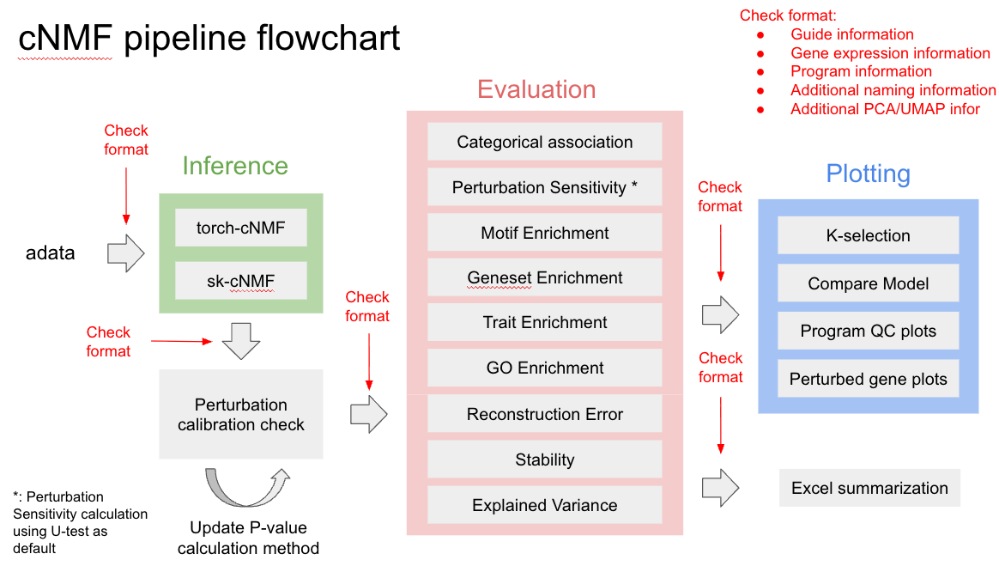

# cNMF Benchmarking Pipeline

## Overview
End-to-end pipeline for running and evaluating consensus Non-negative Matrix Factorization (cNMF) on single-cell data with perturbation experiments.

## Components

### Inference
- **sk-cNMF**: CPU-based implementation using scikit-learn
- **torch-cNMF**: GPU-accelerated implementation using PyTorch

### Evaluation
Comprehensive evaluation metrics including:
- Categorical association analysis
- Perturbation sensitivity testing
- Motif & geneset enrichment
- Trait enrichment analysis
- Explained variance calculation
- Reconstruction error & stability metrics

### Plotting
Quality control and analysis visualization tools:
- K-selection plots for optimal parameter selection
- Program quality control plots
- Perturbed gene analysis visualization

## Usage
1. Run inference using either sk-cNMF or torch-cNMF
2. Evaluate results using the evaluation pipeline
3. Generate plots for analysis and quality control
4. Compile results into Excel summary tables

See individual component READMEs for detailed usage instructions.
